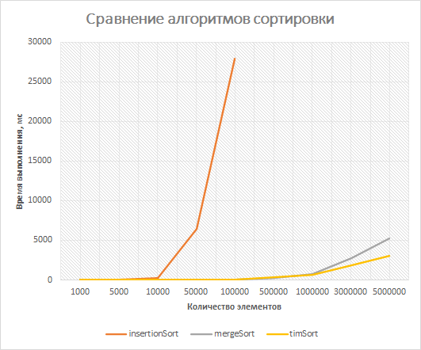

# Лабораторные работы по курсу "Алгоритмы и структуры данных"
Университет ЛЭТИ.

## Лабораторная №1. Списочные структуры
- Односвязный список и динамический массив
- Стек на основе этих структур 
- Алгоритм сортировочной станции (постфиксная запись)

## Лабораторная №2. Сортировки
- Алгоритм сортировки Timsort на основе структур данных из лабораторной №1
- Сравнение производительности с Merge sort, Insertion sort

Получены результаты:

## Лабораторная №3. Деревья
- Чтение двоичного дерева из скобочной записи 
- АВЛ-дерево 
- Обходы дерева в ширину и глубину (в прямом, симметричном и обратном порядках)

## Курсовая работа
- Чтение графа из матрицы смежности
- Система непересекающихся множеств 
- Построение минимального остовного дерева по алгоритму Краскала
